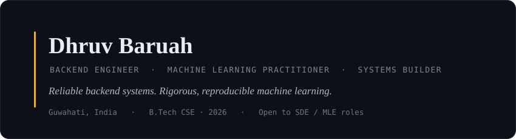

<!--
  GitHub PROFILE README for Dhruv Baruah.
  This goes in a repo named exactly "DHruVBaruAH" (same as your username) so GitHub shows it on your profile.
  Keep header.svg in the repo ROOT next to this file.
  TODO: fix the three project repo links below (two currently point at your profile, not the repo).
-->

  

## About

I'm a final-year Computer Science & Engineering student who builds production backend systems and research-driven machine learning. My backend work centers on Java and Spring Boot — auth, payments, and data integrity for systems real users touch. My ML work is deliberately rigorous: I care more about evaluation that holds up under scrutiny than about a headline accuracy number. Currently looking for software and machine learning engineering roles.

## Selected Work

### House of OVRN — Production E-Commerce Backend &nbsp;·&nbsp; [Repo](https://github.com/DHruVBaruAH)

Live backend for a streetwear brand. A containerized Spring Boot service handling catalog, inventory, cart, and checkout.

- OAuth2 (Google / GitHub) and JWT authorization via Spring Security across every endpoint
- Payment-gateway integration with HMAC-SHA256 signature verification; persistent server-side cart
- Schema integrity enforced through Flyway migrations; deployed on a Docker-based cloud setup

### AdaptED v2 — EEG-Based ADHD Classification &nbsp;·&nbsp; [Repo](https://github.com/DHruVBaruAH/AdaptED-v2-EEG)

A study of how the *evaluation protocol* — not model quality — drives reported accuracy in EEG-based ADHD classification.

- The same 19-channel pipeline scored **93.28%** under epoch-shuffled cross-validation but only **74.17% (AUC 0.7813)** under pre-specified leave-one-subject-out (LOSO) validation
- The ~19-point gap is an evaluation-protocol artifact, not a modeling gain — LOSO is the deployment-realistic number, and it's the one I report
- Full reproducible pipeline: MNE feature extraction (266 features), feature selection, RBF-kernel SVM; 120 clinical subjects (Nasrabadi); Dockerized for repeatable runs

### AdaptED — AI Adaptive Learning Platform &nbsp;·&nbsp; [Repo](https://github.com/DHruVBaruAH)

Full-stack adaptive learning platform with a dedicated ML service for ADHD behavioral assessment.

- Stacking ensemble (LightGBM + XGBoost + CatBoost) on CPT-II clinical features; CV R² = 0.708, chosen over single models for generalization on a small dataset
- Polyglot architecture: Spring Boot + FastAPI ML service + React/TypeScript frontend
- Anthropic Claude API integration, validated end-to-end with unit and integration tests

## Tech Stack

**Backend** &nbsp;

**Machine Learning** &nbsp;

**Data** &nbsp;

**Infrastructure & Tools** &nbsp;

## Now

Deepening production backend work — Spring Security and OAuth2 architectures — alongside applied ML and the MLOps fundamentals that make it deployable: reproducible pipelines, containerized evaluation, and experiment tracking.

## Recognition

- **Google Developer Student Club** — Co-Head, App Development (2023–24); led sprint-based Java workshops for 50+ students
- **TCS NQT 2025** — cleared national qualifier
- **Edunet Foundation ML Program** (Shell India, 2025) — built an energy-prediction pipeline with SHAP-based explainability

<!--
  ============================================================
  OPTIONAL — GitHub stats. KEEP ONLY IF YOUR NUMBERS LOOK GOOD.
  These widgets expose your real commit count, stars, and language split.
  If your activity is light, DELETE this whole block — sparse stats read
  worse than no stats. Streak-stats deliberately omitted (most punishing if low).
  Top-languages hides html/css so your Java/Python read clearly.
  ============================================================
-->

  
  

---

  
  &nbsp;
  
  &nbsp;
  

